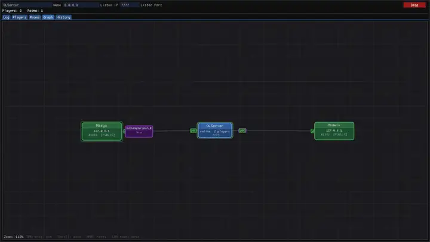

# OpenOL Relay

<p align="center">
  <a href="./README.md">🇺🇸 English</a> /
  <a href="./README_RU.md">🇷🇺 Русский</a>
</p>



TUI/GUI - Relay between [OpenOL](https://github.com/ShyKiss/OpenOL) clients — a modded client for the game Outlast.

Relay is a UDP server that receives packets from OpenOL clients and forwards them to the other players in the same room. The server does not simulate the game world — it relays packets as-is and stores state snapshots so that a player who joins later sees an up-to-date location.

## Features

- **UDP server** for 128 clients and up to 64 rooms
- **Rooms** with or without a password, "trusted" IPs (no need to re-enter the password)
- **Bans** — global and per-room, with a reason
- **World sync** for players who join later: player, door, enemy and pickup states
- **Door priority per player** — while one player is interacting with a door, the others get a denial (`DOOR_DENY`)
- **Settings storage** in `relay.db` (JSON) next to the executable
- **Two interface types**: TUI (console with a scrolling log and an input line) and a GUI built on ImGui
- **Packet rate limiting** and automatic timeout of inactive clients

## Configuration

All settings are stored in the `relay.db` file (JSON format), which is created next to the executable. Rooms, passwords, trusted IP lists and bans are kept there as well:

```json
{
  "config": {
    "name": "OLServer",
    "ip": "0.0.0.0",
    "port": "7777"
  },
  "rooms": [
    {
      "code": "PUBLIC",
      "password": "",
      "trusted": [],
      "bans": []
    }
  ],
  "bans": []
}
```

The file is rewritten when settings are changed through commands/GUI and on server shutdown.

## Commands

Available both in the TUI and in the input field on the **Log** tab in the GUI.

| Command | Description |
| --- | --- |
| `list` | List players per room |
| `rooms` | List active rooms |
| `kick <id>` | Kick a player |
| `ban <id> [reason]` | Global ban by the player's IP |
| `ban room <code> <id> [reason]` | Ban a player in a specific room |
| `unban <ip>` | Remove a global ban |
| `unban room <code> <ip>` | Remove a ban in a room |
| `bans` | List all bans |
| `trust add <room> <ip>` | Manually add an IP to a room's trusted list |
| `trust remove <room> <ip>` | Remove an IP from the trusted list |
| `trust list [room]` | List trusted IPs |
| `room create <code> [password]` | Create a room |
| `setpw <code> <password>` | Change a room's password (the trusted IP list is cleared) |
| `quit` | Shut down the server |

## Built with

| Project | Purpose |
| --- | --- |
| [OpenOL](https://github.com/ShyKiss/OpenOL) | The modded Outlast client this Relay is made for |
| [Dear ImGui](https://github.com/ocornut/imgui) | Graphical interface (GUI build) |
| [SDL2](https://github.com/libsdl-org/SDL) | Window and input for the GUI build on Linux/macOS |
